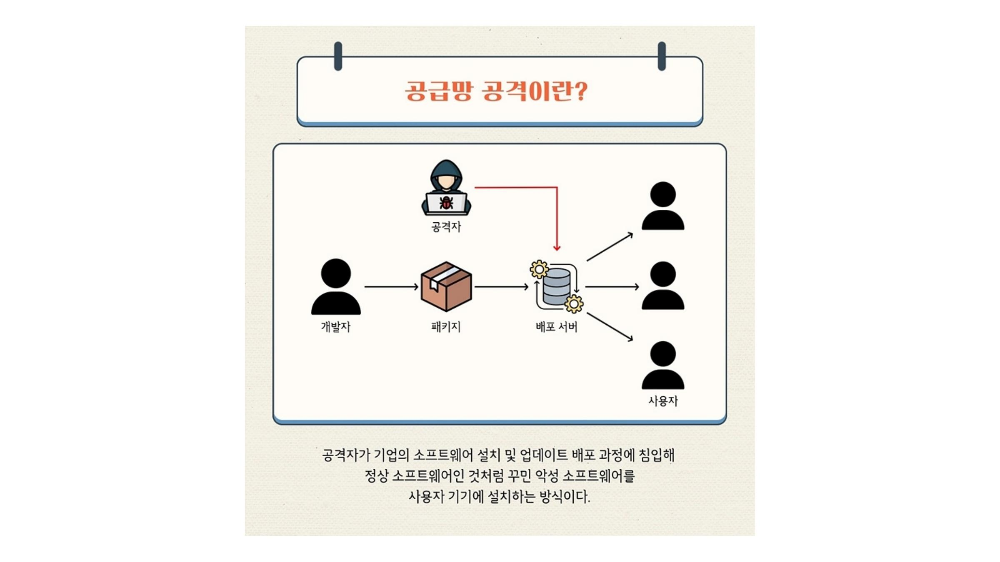
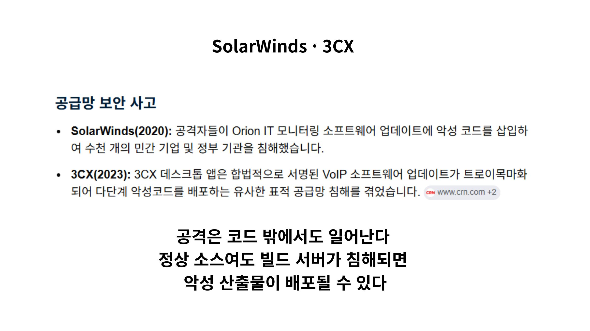
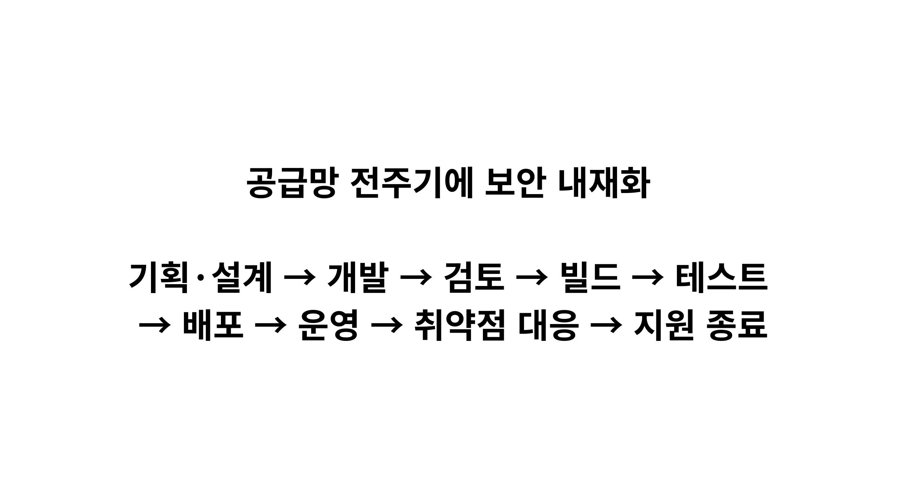
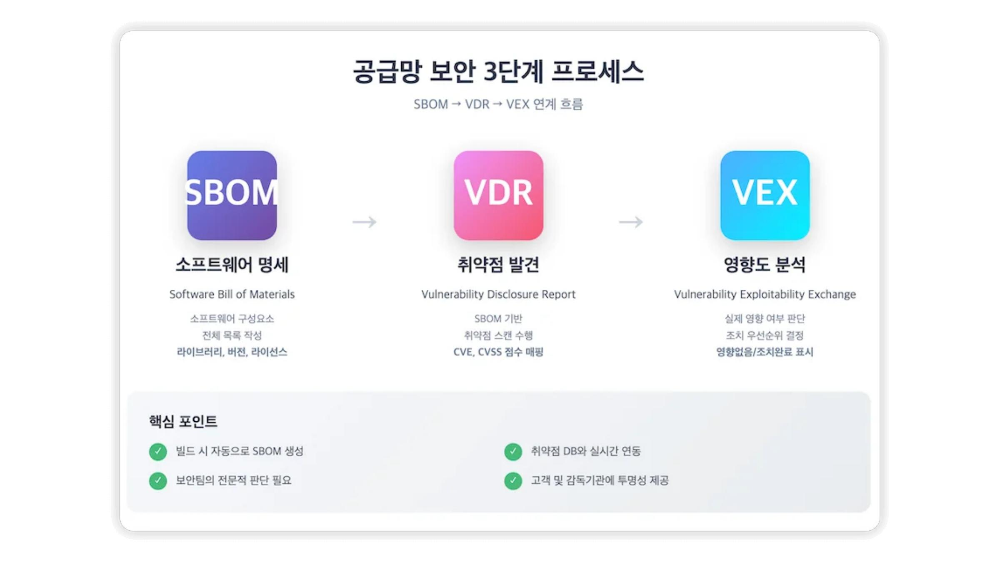
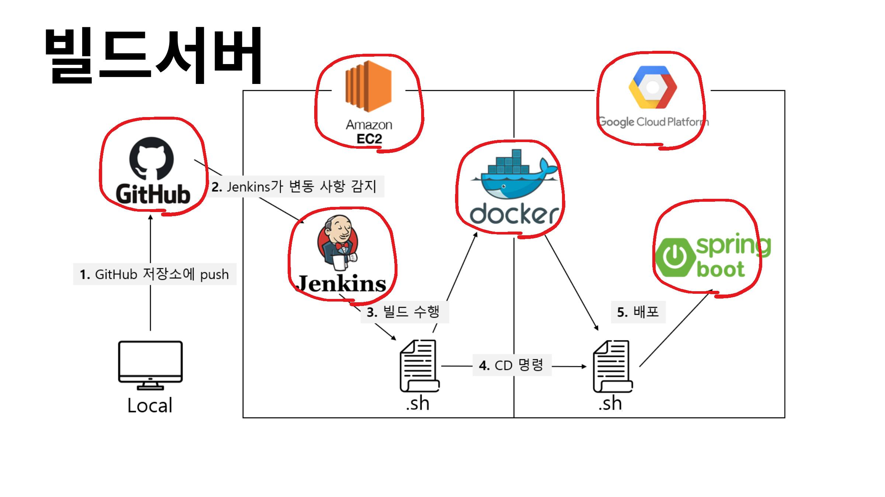
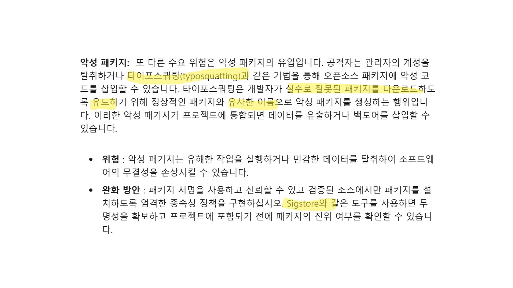
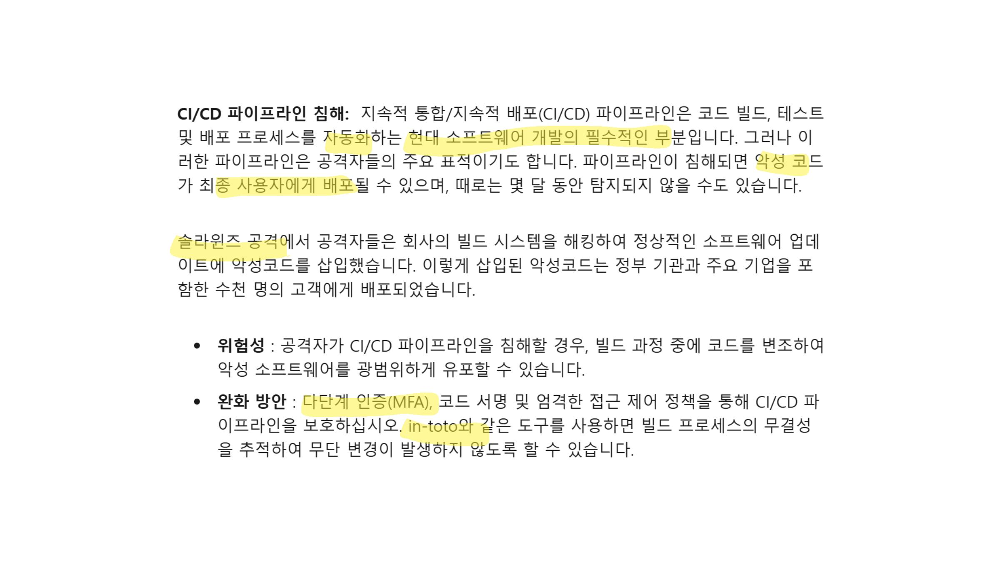
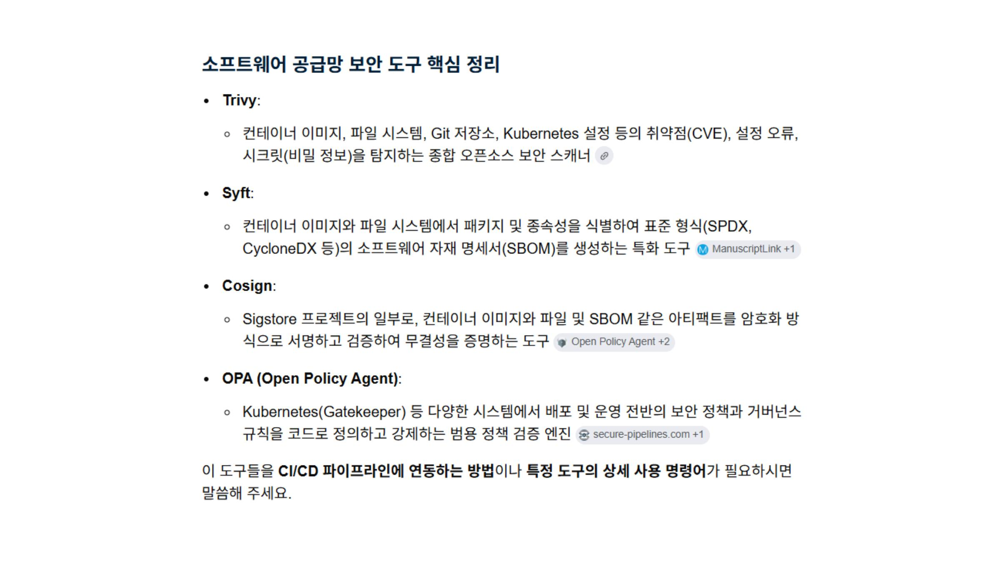

# 1주차: 개발·오픈소스 공급망

Canva에서 제작한 37페이지 발표자료의 핵심 내용을 이미지와 함께 정리했습니다.

> 발표자: 이현지

- [Canva 원본 보기](https://canva.link/by230svtg39mpp6)
- [37페이지 발표자료 PDF 보기](./개발·오픈소스%20공급망.pdf)

---

## 1. 공급망 공격은 왜 위험한가?

공급망 공격은 최종 사용자 한 명씩을 직접 공격하는 대신, 사용자가 신뢰하는 **패키지·빌드 서버·배포 서버·업데이트 경로**를 먼저 장악합니다.

정상 프로그램처럼 배포되기 때문에 사용자는 공격을 알아차리기 어렵고, 한 번의 침해가 많은 사용자에게 동시에 전파될 수 있습니다. 따라서 공급망 보안은 소스 코드만 검사하는 것이 아니라 패키지 설치부터 빌드와 배포까지 모두 확인해야 합니다.

## 2. 정상 소스 코드만으로는 안전을 보장할 수 없다

SolarWinds와 3CX 사례의 공통점은 신뢰받던 소프트웨어의 **업데이트 또는 빌드 과정**이 공격 통로가 되었다는 점입니다.

소스 저장소가 정상이어도 빌드 서버가 침해되면 악성 코드가 포함된 산출물이 만들어질 수 있습니다. 그래서 다음 항목을 따로 검증해야 합니다.

- 누가 빌드를 실행했는가?
- 어떤 소스와 의존성으로 만들었는가?
- 빌드 이후 산출물이 변경되지 않았는가?
- 실제 배포된 파일이 검증한 파일과 같은가?

## 3. 보안은 개발 마지막이 아니라 전 주기에 들어가야 한다

공급망 보안은 출시 직전에 취약점 검사 한 번을 수행하는 작업이 아닙니다.

기획·설계 단계에서는 신뢰 경계와 외부 의존성을 정하고, 개발과 검토 단계에서는 코드와 패키지를 점검합니다. 빌드와 배포 단계에서는 권한·서명·산출물 무결성을 확인하고, 운영 단계에서는 새로 공개되는 취약점과 실제 영향 범위를 계속 추적해야 합니다.

## 4. SBOM → 취약점 발견 → VEX로 연결한다

세 단계는 서로 다른 질문에 답합니다.

1. **SBOM:** 제품 안에 어떤 라이브러리와 버전이 들어 있는가?
2. **취약점 분석:** 그 구성요소에 알려진 취약점이 존재하는가?
3. **VEX:** 발견된 취약점이 이 제품에서 실제로 악용 가능한가?

SBOM만 만들고 끝내면 구성요소 목록만 쌓이게 됩니다. 취약점 데이터와 연결하고, 실행 경로·설정·완화 조치를 살펴 실제 영향도를 판단해야 대응 우선순위를 정할 수 있습니다.

## 5. 빌드 서버는 공급망의 핵심 신뢰 지점이다

개발자의 코드는 GitHub를 거쳐 Jenkins 같은 빌드 도구에서 실행되고, 컨테이너 이미지나 실행 파일로 만들어져 운영환경에 배포됩니다.

이 과정에는 저장소 접근 토큰, 클라우드 권한, 서명 키처럼 강한 권한이 모입니다. 따라서 빌드 서버가 침해되면 정상 개발자의 권한을 이용해 악성 산출물을 대규모로 배포할 수 있습니다.

핵심 방어는 최소 권한, 다단계 인증, 일회성 빌드 환경, 변경 이력 보존, 산출물 서명과 빌드 출처 증명입니다.

## 6. 대표적인 공격 경로

### 악성 패키지와 타이포스쿼팅

공격자는 정상 패키지와 비슷한 이름을 만들어 개발자의 오타를 유도하거나, 관리자 계정을 탈취해 정상 패키지에 악성 코드를 넣을 수 있습니다.

패키지 이름만 보지 말고 배포자, 다운로드 출처, 버전 변경 내용과 무결성 정보를 확인해야 합니다. 가능하면 Lock file과 내부 패키지 저장소를 사용하고 허용된 패키지만 설치하도록 제한합니다.

### CI/CD 파이프라인 침해

CI/CD는 빌드와 배포를 자동화하므로 공격자가 노리는 핵심 지점입니다. 파이프라인의 토큰이나 실행 환경이 탈취되면 악성 코드가 정상 배포 절차를 통해 사용자에게 전달될 수 있습니다.

파이프라인 권한을 분리하고 비밀정보를 안전하게 관리해야 합니다. 외부 Action과 플러그인은 버전을 고정하고, 배포 승인과 서명 검증을 통해 빌드 결과가 임의로 바뀌지 않았는지 확인합니다.

## 7. 도구는 역할을 구분해서 사용한다

- **Trivy:** 컨테이너·파일 시스템·저장소의 취약점과 설정 오류 등을 검사
- **Syft:** 컨테이너 이미지와 파일 시스템에서 패키지를 찾아 SBOM 생성
- **Cosign:** 컨테이너 이미지와 SBOM 같은 산출물에 서명하고 검증
- **OPA:** 배포 허용 조건을 정책 코드로 정의하고 자동으로 검사

한 도구가 공급망 전체를 보호하지는 않습니다. **구성요소 파악 → 취약점 탐지 → 산출물 서명 → 배포 정책 적용**처럼 각 도구를 파이프라인의 단계에 맞게 연결해야 합니다.

---

## 이번 자료에서 기억할 핵심

1. 내가 직접 작성하지 않은 코드도 최종 제품에 포함된다.
2. 공격은 패키지뿐 아니라 저장소·빌드·배포·업데이트 과정에서도 일어난다.
3. SBOM은 시작점이며 취약점 분석과 VEX가 함께 필요하다.
4. 빌드 산출물의 출처와 무결성을 서명과 기록으로 증명해야 한다.
5. 공급망 보안은 개발 전 주기에 반복적으로 적용해야 한다.
