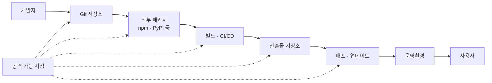

# 개발·오픈소스 공급망

> 원본 학습자료: [Canva - 1주차: 개발·오픈소스 공급망](https://canva.link/by230svtg39mpp6)

## 한눈에 보는 개발 공급망



소프트웨어 공급망은 개발자가 코드를 작성하는 순간부터 완성된 프로그램이 사용자 환경에서 실행될 때까지 참여하는 사람, 코드, 외부 패키지, 저장소, 빌드 시스템과 배포 시스템 전체를 뜻한다.

## 핵심 개념

### 직접 의존성과 전이 의존성

- **직접 의존성**: 개발자가 프로젝트에 직접 추가한 라이브러리
- **전이 의존성**: 직접 설치한 라이브러리가 내부적으로 필요로 해서 함께 설치되는 라이브러리

```text
내 프로젝트
└─ 내가 직접 설치한 라이브러리
   └─ 그 라이브러리가 사용하는 패키지
      └─ 또 다른 하위 패키지
```

내가 직접 선택하지 않은 코드도 최종 제품에 포함될 수 있으므로 전체 의존성 트리를 확인해야 한다.

## 주요 위험

| 단계 | 대표 위험 |
|---|---|
| 개발자 | 계정·토큰 탈취, 비밀정보 커밋 |
| Git 저장소 | 악성 커밋, 리뷰 없는 병합, 브랜치 변조 |
| 외부 패키지 | 취약한 패키지, 악성 패키지, 타이포스쿼팅 |
| 빌드·CI/CD | 빌드 서버 침해, 외부 Action 변조, 비밀정보 유출 |
| 산출물 저장소 | 패키지·컨테이너 이미지 교체 |
| 배포·업데이트 | 업데이트 서버 침해, 악성 버전 배포 |
| 운영환경 | 패치 지연, 영향받는 구성요소 식별 실패 |

## 핵심 방어 수단

- **Lock file**: 실제 설치 버전과 무결성 정보를 고정한다.
- **SBOM**: 제품에 포함된 구성요소와 의존 관계를 기록한다.
- **취약점 DB**: 알려진 취약점을 구성요소와 연결한다.
- **VEX**: 알려진 취약점이 해당 제품에서 실제로 악용 가능한지 표현한다.
- **전자서명**: 서명 주체와 서명 후 변조 여부를 확인한다.
- **Provenance**: 산출물이 어떤 소스와 빌드 과정으로 만들어졌는지 기록한다.
- **SLSA**: 소스와 빌드 과정의 무결성 보장 수준을 단계적으로 높인다.

## 학습할 때 던질 질문

1. 외부에서 무엇을 가져오는가?
2. 누가 소스와 빌드 설정을 수정할 수 있는가?
3. 어떤 계정·토큰·서명 키를 신뢰하는가?
4. 구성요소의 출처와 무결성을 어떻게 확인하는가?
5. 문제가 발생하면 어떤 제품과 사용자에게 전파되는가?
6. 취약점 발견·패치·공개의 책임자는 누구인가?

## 다음 실습

Node.js 예제 프로젝트에서 다음을 확인한다.

```bash
npm install axios
npm ls --all
npm explain axios
npm audit
```

확인할 내용:

- `package.json`과 `package-lock.json`의 차이
- 직접 의존성과 전이 의존성
- 실제 설치 버전
- 패키지 다운로드 출처와 무결성 정보
- 취약점 경고가 의미하는 범위와 한계
